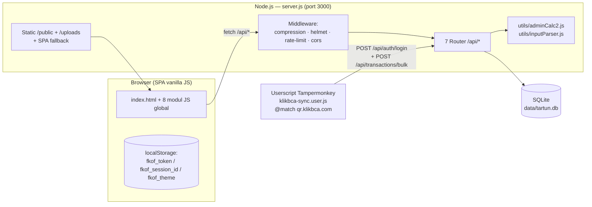
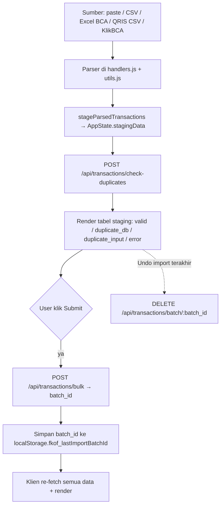

# Tartun V2 — Blueprint Arsitektur

> Dokumen referensi arsitektur untuk **Tartun V2 – Laporan Tarik Tunai Outlet**.
> Ditujukan untuk developer/maintainer. Untuk panduan operasional agent lihat `CLAUDE.md`
> dan `.agents/`. Untuk spesifikasi rebuild dari nol lihat `rebuild_prompt.md`.

Terakhir diperbarui: 2026-08-31 · Basis kode: branch `main`

---

## 1. Ringkasan

Tartun V2 adalah dashboard pelaporan transaksi **tarik tunai** untuk jaringan outlet
pulsa/PPOB di Bandung. Aplikasi menghitung **biaya admin** dan **komisi outlet/CS**
secara otomatis dari data mutasi mentah (paste spreadsheet, upload CSV, laporan Excel
merchant BCA, settlement QRIS, atau userscript KlikBCA), menampilkan ringkasan &
grafik, dan menyediakan alat audit reversal.

Karakteristik kunci:

| Aspek | Pilihan |
|---|---|
| Bentuk | Monolit Express.js + SQLite, satu proses |
| Frontend | SPA vanilla JS, **tanpa build step**, di-serve statis oleh backend yang sama |
| Deploy | `node server.js` lokal atau Docker (target: ZimaOS / home server) |
| Persistensi | 1 file SQLite (`data/tartun.db`), volume Docker |
| Bahasa | UI & komentar kode: Bahasa Indonesia |
| Asal-usul | Hasil migrasi penuh dari backend Supabase REST → Express lokal |

---

## 2. Topologi Sistem



Tidak ada layanan eksternal saat runtime. Aset pihak ketiga (Tailwind, Chart.js,
Lucide, SortableJS, XLSX, jsPDF, html2canvas) dimuat dari CDN publik oleh browser —
aplikasi butuh internet di sisi klien, bukan di sisi server.

---

## 3. Backend

### 3.1 `server.js` — komposisi aplikasi

Urutan middleware (berpengaruh pada perilaku):

1. `compression()` — payload transaksi ±10 MB JSON → ±0.9 MB.
2. `helmet({ contentSecurityPolicy: false })` — CSP dimatikan karena SPA memuat CDN & inline style.
3. `express-rate-limit` — **5000 req / 15 menit / IP**, global (termasuk `/api/auth/login`).
4. `cors()` — terbuka penuh (`*`).
5. `express.json({ limit: '50mb' })` + `urlencoded` 50mb — untuk import massal.
6. Static `public/` dengan `maxAge: 30d`; `index.html` dipaksa `Cache-Control: no-cache`.
7. Static `/uploads` (`maxAge: 7d`) — avatar user.
8. Mount 7 router (lihat §3.4).
9. **SPA fallback**: semua route tak dikenal → kirim `public/index.html`.

Server listen di `0.0.0.0:${PORT || 3000}`.

### 3.2 `db.js` — koneksi & skema

- Satu instance `sqlite3.Database` dibagikan ke seluruh proses (module singleton).
- `initDb()` dijalankan saat koneksi terbuka: `CREATE TABLE IF NOT EXISTS` untuk
  `users`, `transactions`, `logs`, `app_settings` + indeks.
- **Seeding otomatis**:
  - Baris `app_settings` `id = 1` diisi satu blob JSON `defaultSettings` raksasa
    (semua aturan bisnis — lihat §5) bila tabel kosong.
  - User **Master** (`firz411@gmail.com` / `FkOf2025`, hash bcrypt) dibuat bila belum ada.
- PRAGMA performa: `journal_mode = MEMORY`, `synchronous = NORMAL`,
  `cache_size = 10000`, `temp_store = MEMORY`, `busy_timeout = 5000`.
  → Konsekuensi: `journal_mode = MEMORY` mengorbankan durabilitas pada crash demi kecepatan.
- Helper promisified yang **wajib dipakai** (jangan callback mentah):

  | Fungsi | Untuk |
  |---|---|
  | `db.getAsync(sql, params)` | 1 baris |
  | `db.allAsync(sql, params)` | banyak baris |
  | `db.runAsync(sql, params)` | INSERT / UPDATE / DELETE (resolve ke `this` → `lastID`, `changes`) |

  Transaksi multi-statement: `BEGIN TRANSACTION` / `COMMIT` / `ROLLBACK` manual via `runAsync`.

### 3.3 Skema database

```
users
  id INTEGER PK
  email TEXT UNIQUE NOT NULL
  password_hash TEXT NOT NULL
  role TEXT  CHECK(role IN ('Master','Admin','OED','Auditor'))  DEFAULT 'Auditor'
  is_active INTEGER DEFAULT 1
  session_id TEXT                    -- single-session lock
  avatar_url TEXT
  dashboard_config TEXT (JSON)       -- layout widget per user
  filter_presets TEXT (JSON array) DEFAULT '[]'
  last_active_at DATETIME
  created_at DATETIME DEFAULT CURRENT_TIMESTAMP

transactions
  id INTEGER PK
  tanggal DATETIME NOT NULL          -- ISO string
  nama TEXT NOT NULL                 -- nama outlet (sudah dikonsolidasi ke "PARENT ...")
  jumlah REAL NOT NULL               -- bisa negatif (reversal)
  keterangan TEXT                    -- teks mentah, dipakai routing + kalkulasi fee
  tipe_sheet TEXT CHECK(tipe_sheet IN ('MANUAL','TIKET'))
  batch_id TEXT                      -- UUID; mengelompokkan 1 import untuk undo
  created_at DATETIME DEFAULT CURRENT_TIMESTAMP
  indeks: tanggal DESC, batch_id, nama, tipe_sheet, (nama,jumlah,keterangan)

logs
  id, created_at, actor (email), actor_role, action (string), details (JSON string)
  indeks: actor, action

app_settings
  id INTEGER PK DEFAULT 1            -- selalu hanya 1 baris
  settings TEXT NOT NULL (JSON)      -- SATU sumber kebenaran seluruh aturan bisnis
  updated_at DATETIME
```

### 3.4 Router & endpoint

Semua di-mount di bawah `/api`. Kolom **Auth**: `—` publik, `T` butuh token,
`role[...]` butuh `requireRole`.

| Method & Path | Auth | Fungsi |
|---|---|---|
| `POST /api/auth/login` | — | Verifikasi bcrypt, buat `session_id` baru, log `LOGIN_SUCCESS`, kembalikan JWT (7 hari) + profil |
| `GET /api/auth/me` | T | Profil user saat ini |
| `POST /api/auth/check-session` | T | Bandingkan `session_id` klien vs DB (single-session lock); update `last_active_at` |
| `POST /api/auth/logout` | T | Kosongkan `session_id`, log `LOGOUT` |
| `GET /api/transactions` | — | List transaksi. `?limit=all` (default) → **seluruh tabel** dalam 1 response; atau paginasi `?page=&limit=`; filter `search`, `filterType`, `startDate`/`endDate` |
| `POST /api/transactions/bulk` | role[Master,Admin,OED] | Insert massal, chunk 50 baris/statement dalam 1 transaksi, hasilkan/pakai `batch_id`, log `SUBMIT_DATA_*` |
| `POST /api/transactions/check-duplicates` | role[Master,Admin,OED] | Cek duplikat berdasarkan kunci `date|nama|jumlah|keterangan` |
| `DELETE /api/transactions/range?start=&end=` | role[Master] | Hapus rentang tanggal, log `DELETE_DATA_RANGE` |
| `DELETE /api/transactions/batch/:batch_id` | role[Master,Admin,OED] | **Undo import** — hapus semua baris satu `batch_id`, log `UNDO_IMPORT_SUCCESS` |
| `POST /api/transactions/delete-bulk` | role[Master,Admin] | Hapus daftar `ids`, log `DELETE_SELECTED` |
| `PUT /api/transactions/bulk-update` | role[Master,Admin] | Update banyak baris (`[{id, data:{col:val}}]`), log `BULK_UPDATE` |
| `GET /api/summary?start=&end=` | — | Agregasi per-outlet + statistik fee (default: bulan kalender berjalan) |
| `GET /api/dashboard/kpi` | — | KPI dashboard publik: komisi bulan ini, admin kemarin/hari-ini, outlet aktif, trend 7 hari, komposisi tipe, top-5 outlet |
| `GET /api/settings` | — | Baca blob `app_settings` (dibutuhkan frontend & widget publik) |
| `PUT /api/settings` | role[Master] | Timpa seluruh blob settings, log `SAVE_GLOBAL_SETTINGS` |
| `GET /api/users` | T | Daftar user (Admin tidak melihat Master) |
| `POST /api/users` | role[Master,Admin] | Buat user (Admin tak bisa buat Master) |
| `PUT /api/users/:id/role` · `/password` · `/status` | role[Master,Admin] | Kelola user (Admin tak bisa sentuh Master) |
| `DELETE /api/users/:id` | role[Master,Admin] | Hapus user |
| `PUT /api/users/me/avatar` | T | Upload avatar (multer, disk, maks 2 MB, → `uploads/avatars/`) |
| `PUT /api/users/me/dashboard-config` | T | Simpan layout widget pribadi |
| `PUT /api/users/me/password` | T | Ganti password sendiri (min 6 char) |
| `PUT /api/users/me/filter-presets` | T | Simpan preset filter pribadi |
| `GET /api/logs?limit=&actor=` | role[Master,Admin] | Audit log lengkap |
| `GET /api/logs/recent?limit=` | — | Log publik (kecuali `LOGIN*`) untuk panel footer |

### 3.5 Autentikasi & otorisasi

- **JWT** ditandatangani dengan `process.env.JWT_SECRET` (fallback hardcoded di
  `middleware/auth.js`), payload `{ id }`, kedaluwarsa 7 hari. Dikirim via header
  `Authorization: Bearer <token>`.
- `authenticateToken`: verifikasi JWT → `SELECT * FROM users WHERE id` → tolak bila
  user hilang (401) atau `is_active = 0` (403) → `req.user` = baris user penuh.
- `requireRole(...roles)`: cek `req.user.role` ada di daftar.
- **Hierarki peran**: `Master` > `Admin` > `OED` > `Auditor`.
  - `Master` — akses penuh, satu-satunya yang bisa ubah `settings` & hapus rentang tanggal.
  - `Admin` — kelola user & data, tapi tak bisa menyentuh akun `Master`.
  - `OED` — input & undo import.
  - `Auditor` — akses view analisis/audit (read).
  - Publik (belum login) — dashboard, summary, charts.
- **Single-session lock**: `login` menimpa `users.session_id` dengan UUID baru.
  Frontend menyimpan salinan di `localStorage.fkof_session_id` dan tiap 90 dtk
  memanggil `/auth/me`; jika `session_id` DB ≠ lokal → logout paksa + reload.

### 3.6 Utilitas bisnis (`utils/`)

Dipakai server-side oleh `routes/summary.js` & `routes/dashboard.js`. Logika kembar
ada juga di `public/js/utils.js` (`calculateAdminFee`) untuk kalkulator & preview klien.

**`utils/adminCalc2.js`**

- `calculateAdminFee(row, adminRules) → { fee, tiketUnik }`
  1. `value = |jumlah|`, `keterangan` di-uppercase.
  2. Urutkan `adminRules` menaik berdasarkan `amount`.
  3. Ambil rule yang salah satu `keyword`-nya (dipisah koma) muncul di `keterangan`.
  4. Pilih rule pertama dengan `value <= amount`; jika tidak ada, pakai rule terbesar.
  5. `feeType`: `flat` → `feeValue`; `percentage` → `round(value * feeValue/100)`.
  6. Bila `tipe_sheet === 'TIKET'`: tambahkan **kode unik** = 3 digit terakhir bagian
     bulat `value` (mis. `...907` → +907), dikembalikan terpisah sebagai `tiketUnik`.
- `aggregateByOutlet(data, settings) → [{ nama, count, total_jumlah, total_admin_fee,
  komisi_outlet, komisi_cs, _raw }]`, terurut komisi outlet menurun.
  - Fee dipisah `manualFee` vs `tiketFee` (+`tiketUnik`).
  - `komisi_outlet` = `base * (outletCommissionPercentage/100)` lalu dikurangi
    `komisi_cs` = komisi_outlet × `(csCommissionPercentage/100)`.
  - `ticketFeeDestination` menentukan apakah `tiketUnik` masuk basis komisi.

**`utils/inputParser.js`**

- `parseDateWithPriority(str)` — `Date.parse` dulu; lalu heuristik `yyyy-mm-dd` /
  `dd-mm-yyyy` berdasarkan panjang bagian; kembalikan ISO string atau `null`.
- `parseRawDataInput(text, delimiter, settings)` — per baris:
  skip header & baris yang cocok `exceptionKeywords`; parse angka gaya ID
  (`.` ribuan, `,` desimal); konsolidasi `nama` via `nameConsolidation`;
  routing ke `TIKET`/`MANUAL` via `routingKeywords`; baris gagal dikembalikan
  dengan field `error`.

---

## 4. Frontend (`public/`)

### 4.1 Model pemuatan — tanpa bundler

`index.html` memuat, berurutan (`<script defer>`, dengan query cache-bust `?v=x.y.z`):

| Urutan | File | Global | Isi |
|---|---|---|---|
| 1 | `js/state.js` | `AppState`, `DefaultConfig` | State runtime terpusat + fallback config |
| 2 | `js/utils.js` | `AppUtils` | Format mata uang/tanggal, ekspor CSV/JSON/PDF, parser Excel BCA & QRIS, lazy-loader CDN (`ensureXLSX`, `ensureHtml2canvas`) |
| 3 | `js/api.js` | `AppAPI` | Wrapper `fetch` (+ token, timeout 30 dtk, auto-logout 401), dedupe `fetchAllData` |
| 4 | `js/auth.js` | `AppAuth` | `check` / `login` / `logout` / `handleAuthStateChange` |
| 5 | `js/virtualScroll.js` | `VirtualScrollManager` | Virtual scroll tabel (row absolut, buffer 5, throttle 16 ms) |
| 6 | `js/handlers.js` | `AppHandlers` | ±4300 baris — semua logika interaksi: filter, import/staging, audit, summary, user mgmt, settings |
| 7 | `js/ui.js` | `AppUI` | Render view & widget, chart, modal, loader, tema |
| 8 | `js/main.js` | `App` | Objek root; `App.init()` |

CDN dari `<head>`: Tailwind (`cdn.tailwindcss.com`), Chart.js + adapter date-fns +
plugin datalabels, Lucide, SortableJS. XLSX/jsPDF/html2canvas dimuat **lazy**
saat pertama dibutuhkan (dari cdnjs).

### 4.2 Pola "root object + this-binding"

`App` (di `main.js`) menggabungkan semua modul:

```js
const App = { state: AppState, utils: AppUtils, api: AppAPI, auth: AppAuth,
              ui: AppUI, handlers: AppHandlers, settings: {...}, dom: {} };
```

Dalam `App.init()`, **setiap method** dari `utils/api/auth/ui/handlers/settings`
di-`bind(App)`. Efeknya: di dalam modul mana pun, `this` selalu `App`, sehingga
sibling diakses lewat `this.api`, `this.state`, `this.ui`, `this.handlers`,
`this.dom`, dst. `VirtualScrollManager.create()` memakai pola bind serupa per-instance.

> Implikasi saat menulis kode: jangan pakai arrow function untuk method top-level
> modul (akan mengunci `this`). Panggil sibling selalu via `this.`.

### 4.3 State & aliran data klien

`AppState` (di `state.js`) menyimpan a.l.:

- `allData` — **seluruh tabel transaksi** di memori browser (diunduh sekali).
- `settings` — hasil merge `DefaultConfig` ← `/api/settings` ← `dashboard_config` user.
- `currentUser`, `filterPresets`, `activeView`.
- `stagingData` — baris hasil parse import yang belum di-commit.
- `analysisSelectedIds` / `modalSelectedIds` (Set), `currentAuditPairs`.
- `dataIndexes` / `filterCache` — indeks & cache pencarian sisi klien.
- `virtualScrollInstances` — per view (`analysis`, `summary`, `staging`, `userManagement`).
- `dataChannel` / `logChannel` — **sisa dari Supabase realtime, kini no-op**
  (`setupDataListeners` tidak melakukan apa-apa; `handleRealtimeUpdate` masih ada
  tetapi tidak dipicu). Setelah import, klien memuat ulang data via `fetchInitialData`.

Bootstrap (`main.js` → `auth.handleAuthStateChange`):

```
DOMContentLoaded
 → App.init(): bind method, cache DOM, pasang listener, register plugin Chart
 → auth.check() (GET /auth/me bila ada token)
 → handleAuthStateChange:
     - fetchAllData() (GET /transactions?limit=all)  ─┐ paralel
     - settings.load()  (GET /settings)              ─┘
     - fetchInitialData → buildIndexes → render
     - updateMenuVisibility (berdasarkan role)
 → startSessionChecker() (interval 90 dtk)
```

### 4.4 View (template `<template id="{view}-template">` di `index.html`)

| View | Nav role | Isi |
|---|---|---|
| `dashboard` | publik | Grid widget yang dapat dikonfigurasi (KPI, trend chart, top outlet, kalkulator admin, pengumuman) |
| `summary` | publik | Tabel agregasi per-outlet (komisi/fee), kolom & sort dapat diatur |
| `charts` | publik | Grafik dari data teragregasi |
| `analysis` | Auditor/OED/Master/Admin | Tabel transaksi mentah (virtual scroll) + mode **Audit** (pasangan reversal) & mode **Semua Data**; edit inline, seleksi & aksi massal, filter batch via regex RRN |
| `input` | OED/Master/Admin | Import data: paste, CSV, Excel merchant BCA (multi-sheet), settlement QRIS, KlikBCA; tabel *staging* dgn cek duplikat sebelum commit |
| `settings` | Master | Editor blob `app_settings`: aturan admin fee, konsolidasi nama, NMID mapping, aturan audit, persen komisi, layout dashboard publik, tema/wallpaper, kontak WhatsApp |
| `user-management` | Master/Admin | CRUD user + chart distribusi peran |

`ui.switchView(name)` → destroy virtual-scroll view lama → cek role dari
`button.dataset.role` → `renderView` meng-clone `<template>` → panggil
`ui.viewSetups[name]`.

### 4.5 Import & staging (view `input`)



Parser khusus di `utils.js`: `parseMerchantBcaWorkbook` (gabung semua sheet cabang),
`parseQrisSettlementCsv` (ambil baris status `success`), `parseBcaQrisText` (di
`handlers.js`, teks KlikBCA). `extractBatchFilterCodes(rawText, patternStr)` memakai
regex (default `RRN:\s*([^|]+?)\s*\|`) untuk filter batch di view analisis.

### 4.6 Audit reversal

`handlers.getAutoAuditResultsHTML()` memasangkan transaksi reversal dengan aslinya
per `auditRules` (`{ keyword1: "REV TARTUN QR", keyword2: "TARTUN QR" }`):
cari baris yang `keterangan`-nya diawali `keyword1` vs `keyword2`, cocokkan bila
`nama` sama, `|jumlah|` sama, dan sufiks keterangan saling prefix. Pasangan yang
cocok bisa diseleksi & dihapus massal.

---

## 5. `app_settings` — sumber kebenaran aturan bisnis

Satu blob JSON (`app_settings.settings`, `id = 1`). Field utama:

| Field | Arti |
|---|---|
| `adminRules[]` | ±31 bracket biaya admin: `{ keyword, amount, feeType: flat\|percentage, feeValue }` untuk QR / TF,EDC / TIKET,Auto Deposit |
| `nameConsolidation{}` | alias outlet / NMID / kode PLC → nama `PARENT ...` kanonik |
| `nmidMapping{}` | NMID QRIS (`ID10265...`) → nama outlet (dipakai import KlikBCA/QRIS) |
| `routingKeywords{ tiket[], manual[] }` | kata kunci `keterangan` → `tipe_sheet` |
| `exceptionKeywords[]` | baris yang mengandung ini di-skip saat parse (mis. `ADM TARTUN`, `SETOR`) |
| `auditRules[]` | pasangan `{ keyword1 (reversal), keyword2 (asli) }` |
| `outletCommissionPercentage`, `csCommissionPercentage` | 20% & 10% default |
| `targetCommission` | target progress bar dashboard |
| `ticketFeeDestination` | `adminFee` \| `outletCommission` — tujuan `tiketUnik` |
| `monthStartDay` / `monthEndDay` | bulan bisnis **29 → 28** (bukan bulan kalender) |
| `publicDashboardLayout[]`, `dashboardWidgets[]`, `publicSummaryColumns[]` | konfigurasi tampilan |
| `dataParsingSettings{}` | urutan kolom, format tanggal aktif, delimiter CSV (`;`) & paste (`\t`) |
| `backgroundUrl`, `panelBlur`, `isFlatTheme`, `logoText` | tema/branding |

Editor lengkap ada di view `settings` (hanya Master). Backup/restore JSON via menu
Settings (`App.settings.backup()` / `restore()`).

> **Catatan:** `routes/summary.js` & `routes/dashboard.js` memakai `date('now',
> 'start of month')` (bulan kalender), sedangkan bulan bisnis di frontend memakai
> `monthStartDay/EndDay` (29–28). Perbedaan window ini disengaja/diketahui — periksa
> saat menyentuh kalkulasi periode.

---

## 6. Build, jalankan, deploy

```bash
npm install          # meng-compile addon native sqlite3 dari source
npm start            # node server.js → http://0.0.0.0:3000

# Docker (layout produksi; ./data & ./uploads sebagai volume)
docker compose up -d --build
```

- **Tidak ada** test runner (`npm test` stub), linter, atau build frontend.
- Konfigurasi via env: `PORT` (default 3000), `JWT_SECRET` (WAJIB di-set untuk deploy nyata).
- `Dockerfile`: `node:20-slim`, install `python3 make g++` untuk build sqlite3,
  `npm install --build-from-source=sqlite3 --omit=dev`.
- Data yang di-*gitignore*: `data/*.db`, `uploads/avatars/*`, `imports/`.

Inspeksi DB (pakai CLI, bukan skrip Node — driver native sering mismatch di sandbox):

```bash
sqlite3 data/tartun.db ".schema transactions"
sqlite3 data/tartun.db "SELECT id,tanggal,nama,jumlah,keterangan FROM transactions ORDER BY id DESC LIMIT 5"
```

Menaikkan versi aset frontend: ubah `?v=x.y.z` pada tag `<script>`/`<link>` di
`index.html` setiap kali file JS/CSS diedit (jika tidak, browser menyajikan versi cache 30 hari).

---

## 7. Konvensi kode (ditegakkan `.agents/`)

- **Route** selalu modular di `routes/`, di-mount di `server.js`. Jangan definisikan
  route langsung di `server.js`. Template: `.agents/skills/create-endpoint/SKILL.md`.
- **Semua akses DB** lewat helper promisified `db.js` + `async/await`. Tanpa callback.
  Referensi: `.agents/skills/db-operations/SKILL.md`.
- Setiap handler async dibungkus `try/catch`; balikan error JSON konsisten
  (`res.status(5xx).json({ error })`); **jangan bocorkan stack trace** ke klien.
- Query **selalu ter-parameterisasi** (`?`), tidak pernah concat string.
- Catat aksi penting ke tabel `logs` (`actor`, `actor_role`, `action`, `details` JSON).
- Lindungi route mutasi dengan `authenticateToken` + `requireRole`.
- `.agents/rules/*.md` = persona always-on: backend = "Senior Backend Security
  Engineer" (OWASP), frontend = "Premium UI/UX" (glassmorphism, CSS vanilla,
  micro-animation), plus aturan mengoreksi prompt user ke standar proyek.
- `.agents/skills/debug-testing/SKILL.md`: **salin `data/tartun.db` sebelum tes
  destruktif**; isolasi fungsi klien ke skrip Node dengan mock. (Path scratch
  Gemini/antigravity di file itu bukan acuan untuk Claude Code.)

---

## 8. Integrasi KlikBCA

`tools/klikbca-sync.user.js` — userscript Tampermonkey v4.0.1 (di luar `public/`,
tidak disajikan server; pasang manual di Tampermonkey),
`@match https://qr.klikbca.com/*`. Fungsi: scrape mutasi QRIS dari layar KlikBCA,
login ke API Tartun (`POST /api/auth/login`), lalu kirim transaksi
(`POST /api/transactions/bulk`). URL/kredensial Tartun diminta sekali lewat prompt
(menu Tampermonkey "Atur akun Tartun") lalu disimpan via `GM_setValue`.
NMID di data diterjemahkan ke nama outlet lewat `settings.nmidMapping`.

---

## 8a. API Ingest Transaksi QR

`POST /api/v1/ingest/qr` — dipakai sistem lain (payment gateway, skrip, aplikasi)
untuk mengirim transaksi QR langsung ke DB. Dikelola Master di
Pengaturan > Sistem > "API Ingest Transaksi QR".

- **Autentikasi:** header `X-API-Key: tk_...`. Key dibuat/dicabut lewat
  `GET|POST|DELETE /api/api-keys` (khusus Master); tabel `api_keys` hanya menyimpan
  hash SHA-256 + prefix, key asli ditampilkan sekali. Key tidak berlaku untuk API lain.
- **Body:** `{ "transactions": [{ ref, amount, paid_at, outlet_code|outlet_name, method?, payer?, status? }] }`,
  maks 500 item. `paid_at` ISO 8601; tanpa zona dianggap WIB (+07:00). Hanya `status: success`.
- **Pengolahan** (`utils/qrIngest.js`): aturan sama dengan upload file — pemetaan NMID,
  konsolidasi nama, template keterangan `TARTUN QR REF:{ref} ...`, kata pengecualian,
  biaya admin (`admin_fee`), `ref_code`.
- **Idempoten:** indeks unik `uniq_transactions_ref_amount (ref_code, jumlah)` + `INSERT OR IGNORE`;
  kirim ulang / request paralel tidak menggandakan data.
- **Respons:** `{ success, data: { batch_id, received, inserted, duplicates, rejected, results[] } }`,
  status per item `inserted | duplicate | rejected` + alasan. `batch_id` berawalan `api-`,
  tercatat di `logs` (action `API_INGEST`, actor `api:<nama key>`).
- **Batas:** 120 request/menit per IP. Transaksi tulis memakai `db.withTransaction`
  (antrian) karena semua request berbagi satu koneksi SQLite.

---

## 9. Utang teknis & hal yang perlu diperhatikan

| Item | Lokasi | Catatan |
|---|---|---|
| Kredensial Master hardcoded | `db.js` | `firz411@gmail.com` / `FkOf2025` di-seed; ganti setelah deploy |
| `JWT_SECRET` fallback hardcoded | `middleware/auth.js` | Set env var di produksi |
| Rate limit longgar | `server.js` | 5000/15 mnt global; login tidak punya limiter ketat sendiri (kontras dgn arahan `.agents/rules/backend-expert.md`) |
| `helmet` CSP dimatikan | `server.js` | Karena SPA + CDN + inline style |
| `journal_mode = MEMORY` | `db.js` | Risiko kehilangan data pada crash proses |
| Kode realtime Supabase | `handlers.js` (`setupDataListeners`, `handleRealtimeUpdate`), `state.js` (`dataChannel`) | Sudah tidak aktif; multi-user tidak melihat perubahan sampai reload |
| Logika `calculateAdminFee` ganda | `utils/adminCalc2.js` & `public/js/utils.js` | Harus dijaga sinkron secara manual |
| Window periode berbeda | `routes/summary.js`/`dashboard.js` vs frontend | Kalender vs bulan bisnis 29–28 |
| Seluruh tabel transaksi dimuat ke browser | `api.js` `fetchAllData` | Skalabilitas dibatasi memori klien & ukuran payload |
